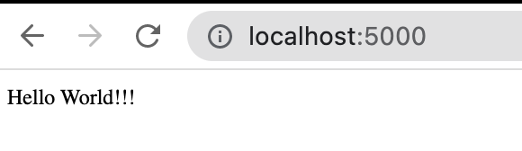
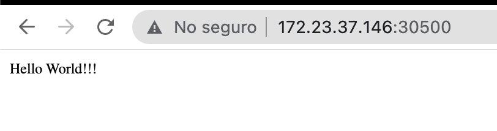

# DevOps Exercise


Este ejercicio contiene un servicio en Python con flask que se encarga de visualizar contenido web ("Hello world!!!"), para ello será necesario de crear una imagen  para despues ejecutar en el servicio de docker o desplegarla en un servicio de Kubernetes.

<br>

### Archivos necesarios para la reacion de la imagen:

<br>

* requirement.txt : en este archivo se encuentran todas las dependencias que se requieren y se instalaran para la ejecución de dicho proyecto. 

* app.py : contiene el codigo de el programa en python. 

* Dockerfile : este archivo contiene las instrucciones que se requieren para la creacion de la imagen.


<br>

## CREACIÓN DE IMAGEN PARA CONTENEDOR.

<br>
Con la ayuda de los siguientes comandos, crear un directorio con el nombre devops-exercise y posisionarse dentro de el.

<br>

```bash
mkdir ~/devops-exercise

cd ~/devops-exercise
```
<br>

Con la ayuda de el siguiente comando, crear los siguientes archivos.

```bash
touch requirement.txt app.py Dockerfile
```
<br>

Agregarles el siguiente contenido.

### requirement.txt
```
click==8.1.2
Flask==2.1.1
itsdangerous==2.1.2
Jinja2==3.1.1
MarkupSafe==2.1.1
pip==22.0.4
setuptools==60.1.0
Werkzeug==2.1.1
wheel==0.37.1
```

### app.py
```python
from flask import Flask

app = Flask(__name__)

@app.route("/")
def hello():
    return "Hello World!!!"


if __name__ == "__main__":
    app.run(debug=True, host='0.0.0.0', port=5000)
```

### Dockerfile
```
FROM alpine:3.10

RUN apk add --no-cache python3-dev \
    && pip3 install --upgrade pip \
    && mkdir /app

WORKDIR /app 

ADD requirement.txt /app 

ADD app.py /app

RUN pip3 --no-cache-dir install -r requirement.txt

CMD ["python3","/app/app.py"]
```

<br>
Ejecutar el siguiente comando para comenzar con la creacion de la imagen.

```bash
docker build -t exercise-devops .
```
<br>
Se comenzará con el proceso de creación de la imagen, esto demorará unos minutos, al finalizar veremos algo como lo siguiente.

```bash
serch@macserch devops-exercise % docker build -t exercise-devops .            
[+] Building 16.4s (12/12) FINISHED                                                                                            
 => [internal] load build definition from Dockerfile                                                                      0.1s
 => => transferring dockerfile: 37B                                                                                       0.0s
 => [internal] load .dockerignore                                                                                         0.0s
 => => transferring context: 2B                                                                                           0.0s
 => [internal] load metadata for docker.io/library/alpine:3.10                                                            1.7s
 => [auth] library/alpine:pull token for registry-1.docker.io                                                             0.0s
 => [1/6] FROM docker.io/library/alpine:3.10@sha256:451eee8bedcb2f029756dc3e9d73bab0e7943c1ac55cff3a4861c52a0fdd3e98      0.0s
 => [internal] load build context                                                                                         0.1s
 => => transferring context: 322B                                                                                         0.0s
 => CACHED [2/6] RUN apk add --no-cache python3-dev     && pip3 install --upgrade pip     && mkdir /app                   0.0s
 => CACHED [3/6] WORKDIR /app                                                                                             0.0s
 => CACHED [4/6] ADD requirement.txt /app                                                                                 0.0s
 => [5/6] ADD app.py /app                                                                                                 0.1s
 => [6/6] RUN pip3 --no-cache-dir install -r requirement.txt                                                             13.4s
 => exporting to image                                                                                                    0.8s
 => => exporting layers                                                                                                   0.8s
 => => writing image sha256:694cc564941d393917263f4fd73b6d8f3a5fcc37095bfd29946b47517f738cbb                              0.0s 
 => => naming to docker.io/library/exercise-devops                                                                        0.0s 
                                                                                                                               
Use 'docker scan' to run Snyk tests against images to find vulnerabilities and learn how to fix them  
```

<br>
Ahora procederemos a validar nuestra imagen creada, ejecutando el siguiente comando.

```bash
docker images
```

<br>
Obteniendo algo como lo siguiente.

```bash
REPOSITORY                  TAG       IMAGE ID       CREATED         SIZE
exercise-devops             latest    15f38e3b9507   2 hours ago     130MB
```
<br>

## EJECUCIÓN EN DOCKER.

<br>
Ya estando creada la imagen, paso seguido es ejecutar el contenedor para realizar una prueba de visualización de contenido, ejecutando el siguiente comando.

```bash
docker run -it -p 5000:5000  exercise-devops
```

<br>

Nos deberá mostrar algo como lo siguiente: 

```bash
 * Serving Flask app 'app' (lazy loading)
 * Environment: production
   WARNING: This is a development server. Do not use it in a production deployment.
   Use a production WSGI server instead.
 * Debug mode: on
 * Running on all addresses (0.0.0.0)
   WARNING: This is a development server. Do not use it in a production deployment.
 * Running on http://127.0.0.1:5000
 * Running on http://172.17.0.2:5000 (Press CTRL+C to quit)
 * Restarting with stat
 * Debugger is active!
 * Debugger PIN: 627-402-787
```

<br>
Esto nos indicará que el servicio ya esta en ejecución y estara escuchando por el puerto 5000 mismo puerto que se esta exponiendo al ejecutar la imagen.

<br>
Abrir un navegador web y consultar la siguiente url.

```
localhost:5000
```

En el navegador se deberá mostrar lo siguiente.



## 


<br>

## DESPLIEGUE EN KUBERNETES.
<br>

Este servicio ahora ya lo podemos de igual forma, desplegar en plataforma de kubernetes.

Para ello, requerimos lo siguiente:

* Subir la imagen creada al servicio de dockerhub.
* Crear los archivos necesarios para realizar el despliegue.
* Ejecutar el despliegue en la plataforma de kubernetes.

### Cargar la imagen exercise-devops al repositorio de docker hub.

<br>

Previo a este paso ya deberemos tener creada una cuenta de docker hub para poder realizar la carga de la imagen.

<br>
Para realizar la carga de la imagen, necesitaremos crear un tag de la imagen ya creada. 
<br>
Ejecutar el siguiente comando.

```bash
docker tag exercise-devops sergiojrp/exercise-devops:1.0
```
<br>
Validar que se ha creado el tag de forma correcta ejecutando lo siguiente.

```bash
docker images
```
<br>
Nos debera mostrar algo como lo siguiente.

```bash
REPOSITORY                  TAG       IMAGE ID       CREATED          SIZE
exercise-devops             latest    15f38e3b9507   40 minutes ago   130MB
sergiojrp/exercise-devops   1.0       15f38e3b9507   40 minutes ago   130MB
```
<br>

### Subir imagen a repositorio de docker hub.
<br>
Ejecutar el siguiente comando.

```bash
docker push sergiojrp/exercise-devops:1.0 
```

<br>
Al ejecutar esto por primera vez, te pedira las credenciales de acceso con las que se ingresa a la cuenta de docker hub.

Despues comenzará con la carga de la imagen al repositorio, al finalizar, mostrará algo como lo siguiente.

```bash
[serch@macserch devops-exercise % docker push sergiojrp/exercise-devops:1.0                   
The push refers to repository [docker.io/sergiojrp/exercise-devops]
5a2442464018: Pushed 
c729ff34192b: Pushed 
02213969ae02: Pushed 
5f70bf18a086: Layer already exists 
38ca10053c98: Layer already exists 
9fb3aa2f8b80: Layer already exists 
1.0: digest: sha256:d23b764a5b78e8490efa1abcb6c2ffcbaff0a710d407eb0645eab19856fbd7d1 size: 1571
```
<br>

### Creación de archivos para despliegue en KS8.

<br>

Para el despliegue en kubernetes, estaremos utilizando 3 archivos:
* ns-devops-exercise.yml : Declaracion de el namespace. 
* svc-devops-exercise.yml : creacion de el servicio de red para exponer el puerto y poder consultarlo desde la web.
* deploy-devops-exercise.yml : Archivo de deploy para el servicio de flask.

<br>
Ejecutar el siguiente comando para crear los archivos.

```bash
touch deploy-devops-exercise.yml ns-devops-exercise.yml svc-devops-exercise.yml
```

<br>
Agregar el siguiente contenido a cada uno de los archivos.

<br>

### ns-devops-exercise.yml 
```yaml
apiVersion: v1
kind: Namespace
metadata:
  name: devops-exercise
```

<br>

### svc-devops-exercise.yml
```yaml
apiVersion: v1
kind: Service
metadata:
  name: devops-exercise 
  namespace: devops-exercise
spec:
  type: NodePort
  selector:
    app: devops-exercise
  ports:
    - port: 5000
      targetPort: 5000
      nodePort: 30500
status:
  loadBalancer: {}
```

<br>

### deploy-devops-exercise.yml
```yaml
apiVersion: apps/v1
kind: Deployment
metadata:
  name: devops-exercise
  namespace: devops-exercise
  labels:
    app: devops-exercise
spec:
  replicas: 2
  selector:
    matchLabels:
      app: devops-exercise
  template:
    metadata:
      labels:
        app: devops-exercise
    spec:
      containers:
      - name: devops-exercise
        image: sergiojrp/exercise-devops:1.0
        imagePullPolicy: Always  
        env:
          - name: TZ
            value: America/Mexico_City
        ports:
        - containerPort: 5000
          name: portal
          protocol: TCP
      restartPolicy: Always
status: {}
```
<br>
Al finalizar de cargar el contenido a los archivos,  ejecutar los siguientes comandos para comenzar a desplegar los servicios.

<br><br>

Creación de Namespace
```bash
kubectl apply -f ns-devops-exercise.yml 
```

Resultado:
```bash
serch@macserch KS8 % kubectl apply -f ns-devops-exercise.yml 
namespace/devops-exercise created
```

<br>
Creación de despliegue.

```bash
kubectl apply -f deploy-devops-exercise.yml 
```

Resultado:
```bash
serch@macserch KS8 % kubectl apply -f deploy-devops-exercise.yml 
deployment.apps/devops-exercise created
```


<br>
Creación de servicio para exponer el puerto y consultarlo desde navegador.

```bash
kubectl apply -f svc-devops-exercise.yml 
```

Resultado:
```bash
serch@macserch KS8 % kubectl apply -f svc-devops-exercise.yml
service/devops-exercise created
```
<br>
Ahora, ejecutar el siguiente comando para revisar los servicios que se estan ejecutando en nuestro namespace.

```bash
kubectl get all -n devops-exercise
```

Nos deberá mostrar algo como lo siguiente:

```bash
NAME                                  READY   STATUS    RESTARTS   AGE
pod/devops-exercise-696bd796c-phgqx   1/1     Running   0          118s
pod/devops-exercise-696bd796c-sz7bd   1/1     Running   0          118s

NAME                      TYPE       CLUSTER-IP     EXTERNAL-IP   PORT(S)          AGE
service/devops-exercise   NodePort   10.233.12.34   <none>        5000:30500/TCP   40s

NAME                              READY   UP-TO-DATE   AVAILABLE   AGE
deployment.apps/devops-exercise   2/2     2            2           119s

NAME                                        DESIRED   CURRENT   READY   AGE
replicaset.apps/devops-exercise-696bd796c   2         2         2       119s
```

<br>
Esto nos indica lo siguiente:

* Se inicializaron 2 pods para la consulta de nuestro servicio de flask, esto debido a que en el archivo deploy-devops-exercise.yml  se especifico que se iniciara con 2 replicas.

* Se encuentra un servicio de tipo NodePort el cual se encarga de realizar un proxeo de el puerto por el que propiamente escucha el pod (5000) a un puerto por el cual se consultara desde internet (30500).

* Un servicio de tipo deployment.

* un servicio de replicaset que se encargara de tener en ejecucion los pods que se indicaron en el deployment.

<br>

Para validar que nuestro servicio esta operando de forma correcta, bastara con consultar en nuestro navegador web la ip de uno de nuestros nodos seguida de el puerto expuesto.

Ejemplo: 

http://172.23.37.146:30500/


<br>
En el navegador se debera mostrar lo siguiente.




<br><br><br>

## Repositorio de la imagen example-devops

- [example-devops - Docker Hub](https://hub.docker.com/repository/docker/sergiojrp/example-devops)


